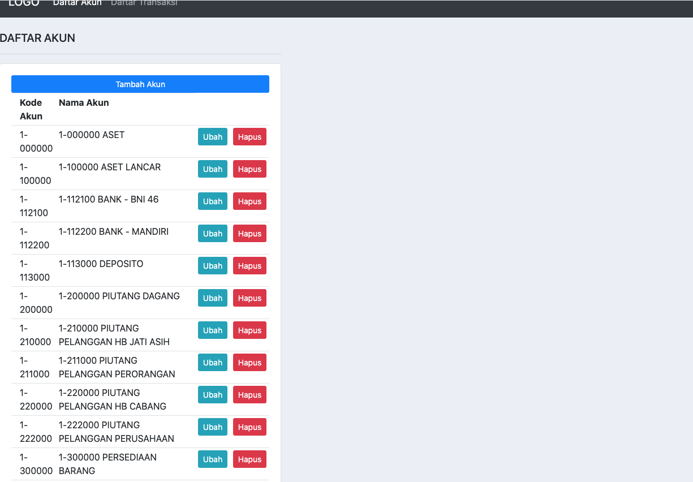
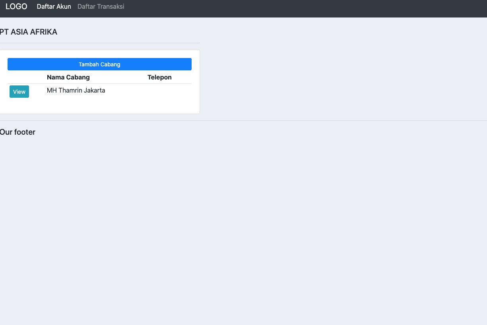
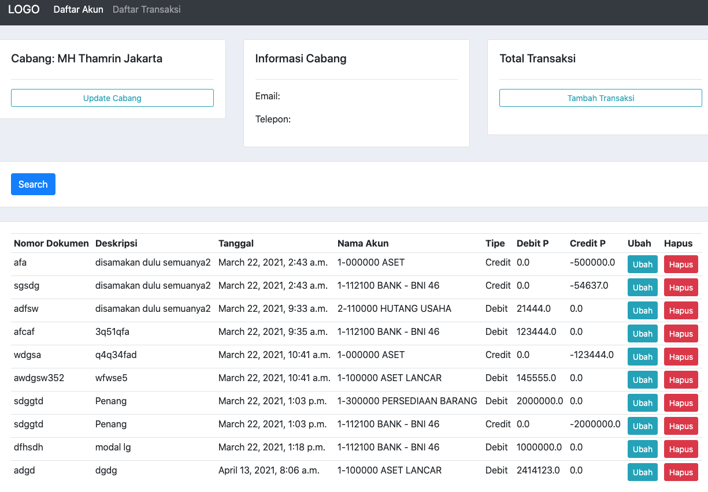
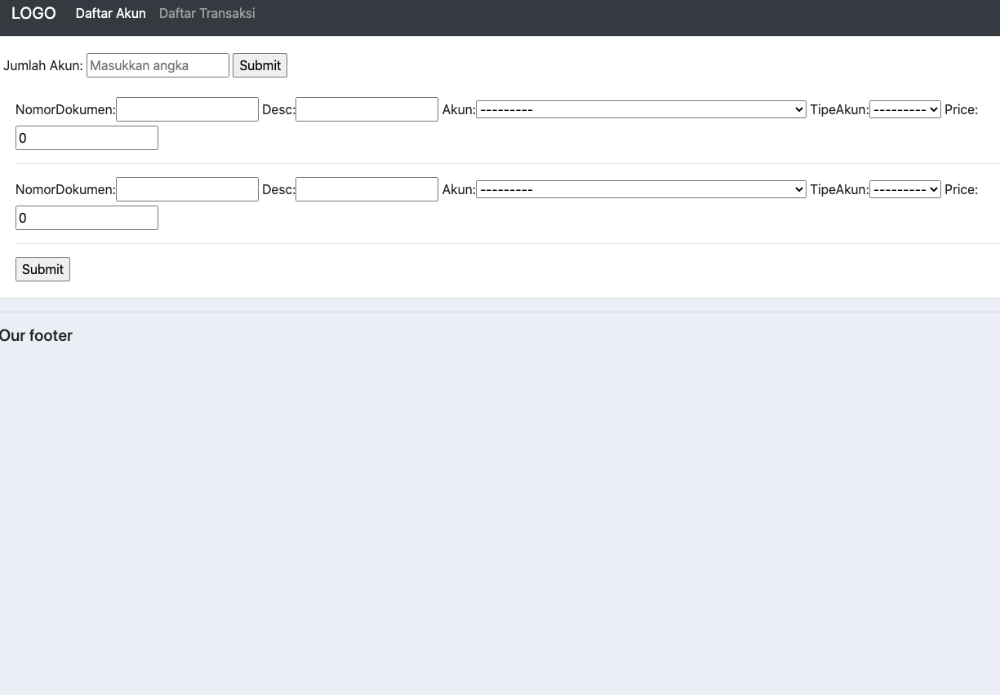

# akuntansi-app

4 fitur utama akuntabel-app ini (pengembangan dari crm-app projectPertama):

1.menambahkan akun transaksi dan populating per kode 

 

2. menambahkan cabang  

3. melihat dan menambahkan transaksi per cabang (crud method)

4. menambahkan transaksi per cabang dan pengolahan akun transaksi

#program still needs to improve because accounting has many conditional for every account name
